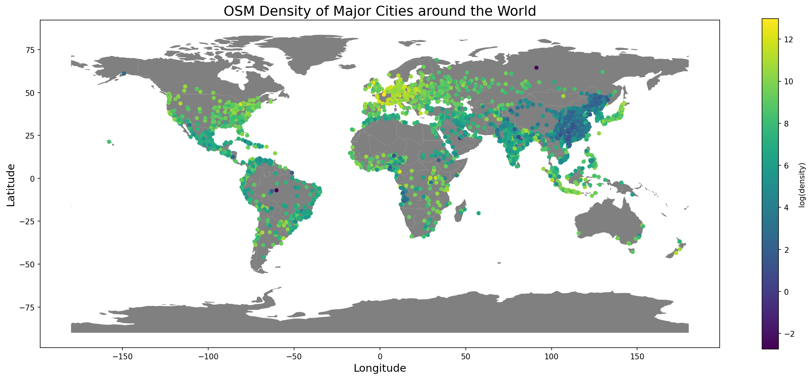

# greenspace-transfer

  

Urban Greenspaces (UGS) are essential for increasingly many humans in urban environments, since they contribute to health, general well being, climate change mitigation and environmentalism. While information about the location and extend of UGS are essential in guiding decisions to improve UGS access for city planners, governments and charities all over the world, there is no source of comprehensive, consistent and accurate data on UGS. Therefore, transferrable models can be used to bridge the data gap, by obtaining knowledge about UGS from data rich regions and applying that knowledge to predict UGS in data scarce regions. Several models and methods of increasing sophistication are tested on their ability to generalize to other regions of the world and effective strategies for creating transferrable methods are proposed. In addition, Open Street Map is evaluated as a potential consistent data source for ground truth UGS segmentation maps.

This repository contains the code to recreate the experiments and visualize the data. The notebooks should be run in the following order: "osm.ipynb" -> "segmentation.ipynb" -> "visualization.ipynb"
